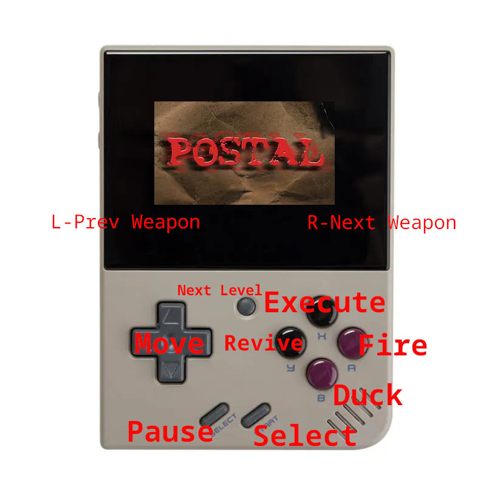

# POSTAL 1 Miyoo Mini+ Port

This is a port of POSTAL 1 for the Miyoo Mini+. This source code also includes community patch ([see here for context](https://github.com/RWS-Studios/POSTAL-SourceCode/issues/1)).

# Default Button Mapping



# Port Work

The bulk of the work for this port is in the Makefile and can be seen here: https://github.com/bostrt/POSTAL-miyoo/commit/5aa36e6d2bd5d2c170651c099409760278559800.

# Build Steps

These steps are distilled from https://github.com/bostrt/sdl2/tree/4f68d46493fc1de447217a36176cffe01e5c8b71?tab=readme-ov-file#build-from-scratch

### Prepare Build Environment
```shell
$ cd POSTAL-miyoo/
$ git submodule update --init --recursive

$ cd sdl2/
$ docker build -t mmiyoo .
```

## Enter Build Environment
```shell
$ cd POSTAL-miyoo/
$ docker run -it --rm -v $(pwd):/workspace mmiyoo /bin/bash
```
*NOTE: include `:z` to volume mount for rootless podman*

## Build SDL2
*Inside container*
```shell
$ cd /workspace/sdl2/
$ make cfg
$ make gpu
$ make sdl2
$ cd /workspace/
$ make MIYOO=1
```

Binary should be at `/workspace/bin/postal1-arm`
